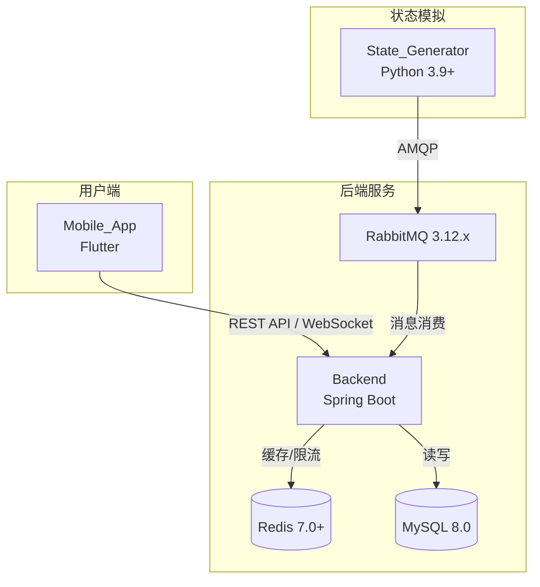
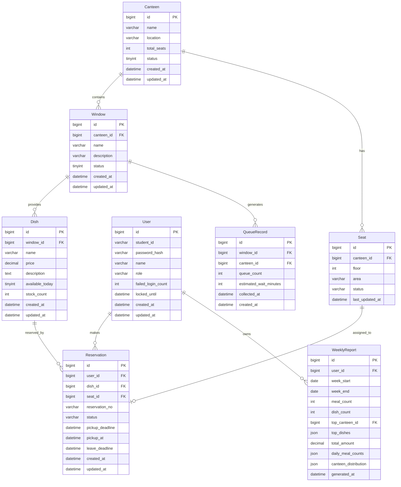

# 设计文档：北京交通大学食堂就餐服务平台

## 概述

北京交通大学食堂就餐服务平台（BJTU Canteen Service）是一套面向师生的移动端服务系统，旨在缓解就餐高峰期拥堵、排队时间长、座位难找等问题。

系统由三个子系统组成：
- **Mobile_App**（Flutter）：师生用户端，提供实时排队展示、菜品预订、搜索、座位查看、个性化推荐及个人周报等功能
- **Backend**（C++ / Drogon）：核心业务逻辑、REST API、WebSocket 推送
- **State_Generator**（Python 3.9+）：状态模拟脚本，预生成历史数据并持续模拟排队与座位状态，通过 RabbitMQ 上报至 Backend

核心技术选型：
- 框架：Drogon（C++ 异步 HTTP/WebSocket 框架）
- 数据库：MySQL 8.0（持久化，通过 Drogon ORM 访问）+ Redis 7.0+（缓存与限流，通过 hiredis）
- 消息队列：RabbitMQ 3.12.x（State_Generator → Backend 异步上报，通过 AMQP-CPP）
- 认证：JWT（访问令牌 + 刷新令牌，通过 jwt-cpp）
- 实时推送：WebSocket（Drogon 内置 WebSocket 支持，Backend → Mobile_App）
- 构建系统：CMake 3.20+

---

## 架构

### 高层架构图



### 请求流程

**师生用户典型流程（预订菜品）：**
1. Mobile_App 发送预订请求（携带 JWT）至 Backend
2. Backend 验证库存 → 分配 AVAILABLE 座位 → 创建 Reservation → 将 Seat 状态更新为 RESERVED
3. Backend 返回预订编号和座位信息至 Mobile_App
4. 15 分钟内用户点击"我已取餐" → Seat 状态更新为 OCCUPIED
5. 用户点击"我已离开" → Seat 状态恢复为 AVAILABLE

**实时数据推送流程：**
1. State_Generator 按模拟规则生成数据 → 发布至 RabbitMQ
2. Backend 消费消息 → 写入 MySQL → 更新 Redis 缓存
3. Backend 通过 WebSocket 推送最新 QueueRecord 至 Mobile_App

---

## 组件与接口

### Backend 服务模块划分

```
backend/
├── CMakeLists.txt
├── main.cc
├── controllers/       # HTTP 控制器（Drogon HttpController）
│   ├── AuthCtrl       # 认证接口
│   ├── CanteenCtrl    # 食堂/排队接口
│   ├── ReservationCtrl# 预订接口
│   ├── SeatCtrl       # 座位接口
│   ├── SearchCtrl     # 搜索接口
│   ├── RecommendCtrl  # 推荐接口
│   └── ReportCtrl     # 周报接口
├── services/          # 业务逻辑层
├── models/            # Drogon ORM 模型（对应数据库表）
├── filters/           # JWT 认证过滤器（Drogon HttpFilter）
├── plugins/           # 插件（Redis、RabbitMQ、定时任务）
└── utils/             # 工具类（JWT、密码哈希、限流）
```

### REST API 接口概览

#### 认证接口（无需鉴权）
| 方法 | 路径 | 描述 |
|------|------|------|
| POST | `/api/v1/auth/login` | 登录，返回 access_token + refresh_token |
| POST | `/api/v1/auth/refresh` | 刷新访问令牌 |
| POST | `/api/v1/auth/logout` | 登出，刷新令牌加入黑名单 |

#### 排队接口（User）
| 方法 | 路径 | 描述 |
|------|------|------|
| GET | `/api/v1/canteens` | 获取所有食堂及拥挤程度 |
| GET | `/api/v1/canteens/{id}/queues` | 获取指定食堂所有窗口排队数据 |
| WS | `/ws/queues` | WebSocket 订阅实时排队推送 |

#### 预订接口（User）
| 方法 | 路径 | 描述 |
|------|------|------|
| POST | `/api/v1/reservations` | 创建预订（自动分配座位） |
| DELETE | `/api/v1/reservations/{id}` | 取消预订（恢复库存和座位） |
| GET | `/api/v1/reservations/my` | 查询当前用户预订列表 |
| POST | `/api/v1/reservations/{id}/pickup` | 确认取餐（RESERVED → OCCUPIED） |
| POST | `/api/v1/reservations/{id}/leave` | 确认离开（OCCUPIED → AVAILABLE） |

#### 搜索接口（User）
| 方法 | 路径 | 描述 |
|------|------|------|
| GET | `/api/v1/dishes/search?q={keyword}&canteen_id={id}` | 菜品搜索（支持按食堂筛选） |

#### 座位接口（User）
| 方法 | 路径 | 描述 |
|------|------|------|
| GET | `/api/v1/canteens/{id}/seats` | 获取指定食堂座位状态统计 |

#### 推荐接口（User）
| 方法 | 路径 | 描述 |
|------|------|------|
| GET | `/api/v1/recommendations` | 获取个性化推荐菜品列表（最多 10 条） |

#### 周报接口（User）
| 方法 | 路径 | 描述 |
|------|------|------|
| GET | `/api/v1/reports/weekly` | 获取历史周报列表 |
| GET | `/api/v1/reports/weekly/{id}` | 获取指定周报详情（含图表数据） |

### WebSocket 消息格式

**服务端推送（排队数据）：**
```json
{
  "type": "QUEUE_UPDATE",
  "timestamp": "2024-01-15T12:00:00Z",
  "data": [
    {
      "window_id": 1,
      "canteen_id": 1,
      "queue_count": 8,
      "estimated_wait_minutes": 4
    }
  ]
}
```

**服务端推送（座位数据）：**
```json
{
  "type": "SEAT_UPDATE",
  "timestamp": "2024-01-15T12:00:00Z",
  "data": {
    "canteen_id": 1,
    "total_seats": 200,
    "available_seats": 80,
    "reserved_seats": 20,
    "occupied_seats": 100
  }
}
```

### RabbitMQ 消息格式（State_Generator → Backend）

**排队数据消息：**
```json
{
  "message_type": "QUEUE_RECORD",
  "canteen_id": 1,
  "window_id": 3,
  "collected_at": "2024-01-15T12:00:00Z",
  "queue_count": 12
}
```

**座位数据消息：**
```json
{
  "message_type": "SEAT_RECORD",
  "canteen_id": 1,
  "collected_at": "2024-01-15T12:00:00Z",
  "available_seats": 80,
  "reserved_seats": 20,
  "occupied_seats": 100
}
```

---

## 数据模型

### 实体关系图



### 关键字段说明

**Reservation.status**：枚举值
- `PENDING`：已预订，待取餐（Seat 处于 RESERVED 状态）
- `PICKED_UP`：已取餐（Seat 处于 OCCUPIED 状态）
- `COMPLETED`：已完成（用户点击"我已离开"，Seat 恢复 AVAILABLE）
- `CANCELLED`：已取消（Seat 恢复 AVAILABLE）
- `EXPIRED`：已超时（Seat 恢复 AVAILABLE）

**Seat.status**：枚举值
- `AVAILABLE`：空闲，可被分配
- `RESERVED`：已预留，对应 Reservation 处于 PENDING 状态
- `OCCUPIED`：占用中，对应 Reservation 处于 PICKED_UP 状态

**座位状态转换规则：**
```
AVAILABLE → RESERVED  （预订成功）
RESERVED  → OCCUPIED  （用户确认取餐）
OCCUPIED  → AVAILABLE （用户确认离开 或 就餐超时60分钟）
RESERVED  → AVAILABLE （取消预订 或 预订超时15分钟）
```

**WeeklyReport.top_dishes**：JSON 数组，格式 `[{"dish_id": 1, "dish_name": "宫保鸡丁", "count": 3}]`，最多 3 条

**WeeklyReport.daily_meal_counts**：JSON 对象，格式 `{"2024-01-08": 2, "2024-01-09": 1, ...}`，用于折线图

**WeeklyReport.canteen_distribution**：JSON 对象，格式 `{"食堂A": 3, "食堂B": 2}`，用于饼图

**Reservation.pickup_deadline**：`created_at + 15分钟`，超时后自动释放座位

**Reservation.leave_deadline**：`pickup_at + 60分钟`，超时后自动释放座位

### Redis 缓存设计

| Key 模式 | 数据类型 | TTL | 说明 |
|----------|----------|-----|------|
| `queue:canteen:{id}` | Hash | 60s | 食堂所有窗口最新排队数据 |
| `seat:canteen:{id}` | Hash | 120s | 食堂座位三态统计 |
| `dish:search:{hash}` | String (JSON) | 30s | 搜索结果缓存 |
| `recommend:user:{id}` | String (JSON) | 60s | 用户推荐列表缓存 |
| `auth:blacklist:{jti}` | String | 与令牌剩余有效期一致 | 已失效刷新令牌黑名单 |
| `ratelimit:ip:{ip}` | String (计数器) | 60s 滑动窗口 | IP 限流计数 |
| `login:fail:{student_id}` | String (计数器) | 15min | 登录失败次数 |

### 数据库索引设计

```sql
-- QueueRecord 查询优化
CREATE INDEX idx_queue_window_time ON queue_record(window_id, collected_at DESC);
CREATE UNIQUE INDEX idx_queue_dedup ON queue_record(canteen_id, window_id, collected_at);

-- Reservation 查询优化
CREATE INDEX idx_reservation_user ON reservation(user_id, status, created_at);
CREATE INDEX idx_reservation_dish ON reservation(dish_id, status);
CREATE INDEX idx_reservation_seat ON reservation(seat_id, status);

-- Seat 查询优化
CREATE INDEX idx_seat_canteen_status ON seat(canteen_id, status);

-- Dish 搜索优化
CREATE FULLTEXT INDEX idx_dish_name ON dish(name);
CREATE INDEX idx_dish_window ON dish(window_id, available_today);

-- WeeklyReport 查询优化
CREATE INDEX idx_report_user_week ON weekly_report(user_id, week_start DESC);
```

---

## 正确性属性

*属性（Property）是在系统所有有效执行路径中都应成立的特征或行为——本质上是对系统应做什么的形式化陈述。属性是人类可读规格说明与机器可验证正确性保证之间的桥梁。*

### 属性 1：有效凭据登录返回令牌对

*对任意* 已注册用户的有效学号和密码，调用登录接口应返回包含 `access_token` 和 `refresh_token` 两个字段的响应，且两个字段均为非空字符串。

**验证需求：1.1**

---

### 属性 2：无效凭据登录不返回令牌

*对任意* 不存在的学号或错误密码，调用登录接口应返回 HTTP 401，且响应体中不包含 `access_token` 或 `refresh_token` 字段。

**验证需求：1.2**

---

### 属性 3：账户锁定机制

*对任意* 用户账户，连续 5 次提交错误密码后，后续任何登录请求（包括正确密码）均应被拒绝，直到锁定期结束。

**验证需求：1.3**

---

### 属性 4：刷新令牌轮换（Round-Trip）

*对任意* 有效的刷新令牌，调用刷新接口应返回新的访问令牌；同一刷新令牌第二次调用刷新接口应返回 HTTP 401（令牌轮换机制保证幂等性）。

**验证需求：1.4**

---

### 属性 5：登出使刷新令牌失效

*对任意* 已登录用户，调用登出接口后，使用该用户的刷新令牌再次调用刷新接口应返回 HTTP 401。

**验证需求：1.5**

---

### 属性 6：无效 JWT 令牌被拒绝

*对任意* 签名无效或已被篡改的 JWT 令牌，访问任意受保护接口应返回 HTTP 401。

**验证需求：1.6**

---

### 属性 7：排队数据 API 完整性

*对任意* 存在的 `canteen_id`，调用排队数据接口应返回该食堂下所有 Window 的排队记录，且每条记录包含 `window_id`、`queue_count` 和 `estimated_wait_minutes` 字段。

**验证需求：2.2**

---

### 属性 8：数据过期判断

*对任意* QueueRecord，若其 `collected_at` 距当前时间超过 60 秒，则该记录的 `is_stale` 标志应为 `true`；反之应为 `false`。

**验证需求：2.5**

---

### 属性 9：拥挤程度颜色编码完备性

*对任意* 非负整数 `queue_count`，颜色分类函数应满足：`queue_count < 5` 返回绿色，`5 <= queue_count <= 15` 返回黄色，`queue_count > 15` 返回红色，三个区间覆盖所有非负整数且互不重叠。

**验证需求：2.6**

---

### 属性 10：预订成功后座位状态变更

*对任意* 库存大于 0 且所在 Canteen 有 AVAILABLE 座位的 Dish，提交预订请求应返回包含非空 `reservation_no` 和 `seat_id` 的成功响应，且对应 Seat 的状态应从 AVAILABLE 变为 RESERVED。

**验证需求：3.1, 5.2**

---

### 属性 11：预订/取消/超时的库存与座位恢复（Round-Trip）

*对任意* 处于 `PENDING` 状态的 Reservation，取消或超时处理后，对应 Dish 的 `stock_count` 应恢复到预订前的值，对应 Seat 的状态应从 RESERVED 恢复为 AVAILABLE；且同一 Reservation 多次取消的结果与取消一次相同（幂等性）。

**验证需求：3.5, 3.6, 5.5, 5.7**

---

### 属性 12：单用户预订数量限制

*对任意* 用户，在同一就餐时段内，当有效 Reservation 数量已达 3 条时，第 4 次预订请求应被拒绝并返回 `RESERVATION_LIMIT_EXCEEDED` 错误。

**验证需求：3.7**

---

### 属性 13：并发预订安全性（库存不变量）

*对任意* 菜品，无论并发预订请求数量多少，成功创建的 Reservation 总数不超过该菜品的初始 `stock_count`，且 `stock_count` 不小于 0。

**验证需求：3.8**

---

### 属性 14：座位状态完整 Round-Trip

*对任意* 成功预订的 Reservation，完整执行"预订 → 确认取餐 → 确认离开"流程后，对应 Seat 的状态应依次经历 AVAILABLE → RESERVED → OCCUPIED → AVAILABLE；若就餐超时（60 分钟未离开），Seat 状态应自动从 OCCUPIED 恢复为 AVAILABLE。

**验证需求：5.3, 5.4, 5.6**

---

### 属性 15：座位容量不变量

*对任意* 食堂，任意时刻 `AVAILABLE 数量 + RESERVED 数量 + OCCUPIED 数量 = 总座位数`，且三个分量均不小于 0。

**验证需求：5.1, 5.8**

---

### 属性 16：搜索结果正确性与完整性

*对任意* 长度在 1–50 字符之间的搜索关键词，返回结果中每个 Dish 的名称都应包含该关键词（精确性），且数据库中所有名称包含该关键词的 Dish 都应出现在结果中（完整性），无论其 `available_today` 状态如何。

**验证需求：4.1, 4.2**

---

### 属性 17：按食堂筛选搜索结果

*对任意* 搜索关键词和 `canteen_id` 筛选条件，返回结果中所有 Dish 的 `canteen_id` 应等于筛选值。

**验证需求：4.4**

---

### 属性 18：搜索关键词长度验证

*对任意* 长度超过 50 字符的搜索关键词，接口应返回 HTTP 400 错误。

**验证需求：4.6**

---

### 属性 19：推荐列表长度不变量

*对任意* 用户，调用推荐接口返回的菜品列表长度应不超过 10 条。

**验证需求：6.1**

---

### 属性 20：推荐排序综合属性

*对任意* 有历史预订记录的用户，推荐列表中历史预订频次较高的 Dish 应排在频次较低的 Dish 前面（在排队权重相同的情况下）；对于排队人数超过 15 人的 Window，其 Dish 的排名不高于同等历史频次但排队人数不超过 15 人的 Window 的 Dish。

**验证需求：6.2, 6.4**

---

### 属性 21：推荐有效性不变量

*对任意* 用户，推荐列表中的所有 Dish 均满足 `available_today = 1` 且所属 Window 存在，不出现已下架或不存在的菜品。

**验证需求：6.5**

---

### 属性 22：周报数据一致性

*对任意* 用户的任意一周 WeeklyReport，其 `meal_count` 应等于该用户本周状态为 `PICKED_UP` 或 `COMPLETED` 的 Reservation 数量；其 `total_amount` 应等于本周所有有效 Reservation 对应 Dish 价格的总和。

**验证需求：7.2**

---

### 属性 23：历史周报列表完整性

*对任意* 用户，调用历史周报列表接口应返回该用户所有已生成的 WeeklyReport，且按 `week_start` 降序排列。

**验证需求：7.4**

---

### 属性 24：消息序列化 Round-Trip

*对任意* State_Generator 生成的 QueueRecord 或 Seat 模拟数据，序列化为消息后再反序列化，所有字段值应与原始数据完全一致（`deserialize(serialize(record)) == record`）。

**验证需求：8.6**

---

### 属性 25：无效消息格式拒绝

*对任意* 不符合 Schema 定义的消息（缺少必需字段或字段类型错误），Backend 应拒绝该消息并记录错误日志，且不影响后续有效消息的正常处理。

**验证需求：8.7**

---

### 属性 26：消息去重幂等性

*对任意* 具有相同 `(canteen_id, window_id, collected_at)` 的重复消息，无论被 Backend 消费多少次，数据库中对应的记录数始终为 1。

**验证需求：8.8**

---

### 属性 27：IP 限流不变量

*对任意* IP 地址，在任意 60 秒滑动窗口内，成功处理的请求数不超过 300 次；第 301 次及以后的请求应返回 HTTP 429。

**验证需求：9.4**

---

## 错误处理

### 统一错误响应格式

```json
{
  "code": "ERROR_CODE",
  "message": "人类可读的错误描述",
  "details": [
    {
      "field": "字段名（仅字段级错误时存在）",
      "message": "字段级错误描述"
    }
  ],
  "timestamp": "2024-01-15T12:00:00Z",
  "request_id": "uuid"
}
```

### 错误码定义

| HTTP 状态码 | 错误码 | 场景 |
|-------------|--------|------|
| 400 | `VALIDATION_ERROR` | 请求参数不满足约束 |
| 400 | `KEYWORD_TOO_LONG` | 搜索关键词超过 50 字符 |
| 401 | `INVALID_CREDENTIALS` | 学号或密码错误 |
| 401 | `ACCOUNT_LOCKED` | 账户被锁定 |
| 401 | `TOKEN_EXPIRED` | 访问令牌已过期 |
| 401 | `TOKEN_INVALID` | 令牌签名无效或已被篡改 |
| 401 | `REFRESH_TOKEN_USED` | 刷新令牌已被使用（轮换机制） |
| 403 | `PERMISSION_DENIED` | 角色权限不足 |
| 404 | `RESOURCE_NOT_FOUND` | 请求的资源不存在 |
| 409 | `STOCK_INSUFFICIENT` | 菜品库存不足 |
| 409 | `NO_AVAILABLE_SEAT` | 食堂无可用座位 |
| 409 | `RESERVATION_LIMIT_EXCEEDED` | 超过单用户预订数量限制 |
| 409 | `INVALID_SEAT_STATUS` | 座位状态不允许当前操作 |
| 429 | `RATE_LIMIT_EXCEEDED` | IP 请求频率超限 |
| 500 | `INTERNAL_ERROR` | 服务器内部错误 |

### 关键错误处理策略

**并发预订冲突**：使用 Redis 分布式锁（`SETNX`）保证同一菜品的库存扣减原子性。当检测到并发冲突时，返回 `STOCK_INSUFFICIENT` 而非 500 错误。

**座位分配冲突**：使用数据库乐观锁（`version` 字段）或 `SELECT ... FOR UPDATE` 保证座位分配的原子性，防止同一座位被多个预订同时分配。

**超时任务**：使用 Spring `@Scheduled` 定时任务（每分钟扫描一次）处理预订超时（15 分钟）和就餐超时（60 分钟），将过期的 Reservation 状态更新并释放座位。

**RabbitMQ 消息消费失败**：消费失败的消息进入死信队列（DLQ），不阻塞正常消息处理。

**Redis 缓存穿透**：对不存在的资源查询，在 Redis 中缓存空值（TTL 5 秒），防止大量请求直接打到 MySQL。

**WebSocket 连接断开**：客户端断开后，服务端清理对应的订阅关系；客户端重连后重新建立订阅，服务端立即推送最新数据。

---

## 测试策略

### 双轨测试方法

本系统采用单元测试和属性测试相结合的方式，两者互补，共同保证系统正确性：

- **单元测试**：验证具体示例、边界条件和错误场景
- **属性测试**：通过随机生成大量输入验证普遍性规则

### 属性测试配置

**Java 后端（Spring Boot）**：使用 [jqwik](https://jqwik.net/) 属性测试框架

```xml
<dependency>
    <groupId>net.jqwik</groupId>
    <artifactId>jqwik</artifactId>
    <version>1.8.x</version>
    <scope>test</scope>
</dependency>
```

**Python State_Generator**：使用 [Hypothesis](https://hypothesis.readthedocs.io/) 属性测试框架

```bash
pip install hypothesis
```

**Flutter 移动端**：使用 `flutter_test` 配合自定义生成器

每个属性测试最少运行 **100 次迭代**，每个测试必须通过注释标注对应的设计属性：

```java
// Feature: bjtu-canteen-service, Property 13: 并发预订安全性（库存不变量）
@Property(tries = 100)
void concurrentReservationSafety(...) { ... }
```

### 各模块测试重点

#### Auth_Service 测试
- 属性测试：属性 1–6（令牌签发、锁定机制、令牌轮换、无效令牌拒绝）
- 单元测试：JWT 签名验证、令牌过期时间计算、黑名单查询
- 边界测试：恰好第 5 次失败触发锁定、锁定期结束后恢复

#### Reservation_Service + Seat_Service 测试
- 属性测试：属性 10–15（预订创建、库存恢复、并发安全、座位状态 Round-Trip、容量不变量）
- 单元测试：预订编号生成格式、超时任务触发逻辑、座位分配算法
- 并发测试：使用 `ExecutorService` 模拟 100 个并发预订请求，验证属性 13

#### Search_Service 测试
- 属性测试：属性 16–18（搜索正确性与完整性、按食堂筛选、长度验证）
- 单元测试：空关键词处理、特殊字符转义、全文索引查询

#### Queue_Service 测试
- 属性测试：属性 7–9（排队数据完整性、数据过期判断、颜色编码完备性）
- 单元测试：Peak_Hour 判断逻辑、推送频率切换

#### Recommendation_Service 测试
- 属性测试：属性 19–21（推荐列表长度、排序综合属性、有效性不变量）
- 单元测试：新用户全局热门逻辑、排队权重降级计算

#### Report_Service 测试
- 属性测试：属性 22–23（周报数据一致性、历史列表完整性）
- 单元测试：周报生成触发逻辑、无预订记录用户不生成周报（edge case）、图表数据格式验证

#### State_Generator 测试（Python/Hypothesis）
- 属性测试：属性 24–26（序列化 Round-Trip、无效消息拒绝、去重幂等性）
- 单元测试：模拟数据生成逻辑（高峰期/非高峰期分布）、历史数据预生成完整性验证（每个 Demo 账号 ≥ 20 条记录）

### 集成测试

使用 Testcontainers 启动真实的 MySQL、Redis、RabbitMQ 容器进行集成测试：

```java
@Testcontainers
class ReservationIntegrationTest {
    @Container
    static MySQLContainer<?> mysql = new MySQLContainer<>("mysql:8.0");
    @Container
    static GenericContainer<?> redis = new GenericContainer<>("redis:7.0");
    @Container
    static RabbitMQContainer rabbitmq = new RabbitMQContainer("rabbitmq:3.12");
}
```

集成测试覆盖：
- State_Generator → RabbitMQ → Backend → MySQL 完整数据流
- 预订 → 取餐确认 → 离开确认完整流程（含座位状态变更）
- 超时任务触发后的库存和座位恢复
- WebSocket 推送端到端验证

### 单元测试原则

- 避免过多单元测试，属性测试已覆盖大量输入组合
- 单元测试聚焦于：具体示例、组件集成点、错误条件
- 每个服务模块的核心业务逻辑单元测试覆盖率目标 ≥ 80%
